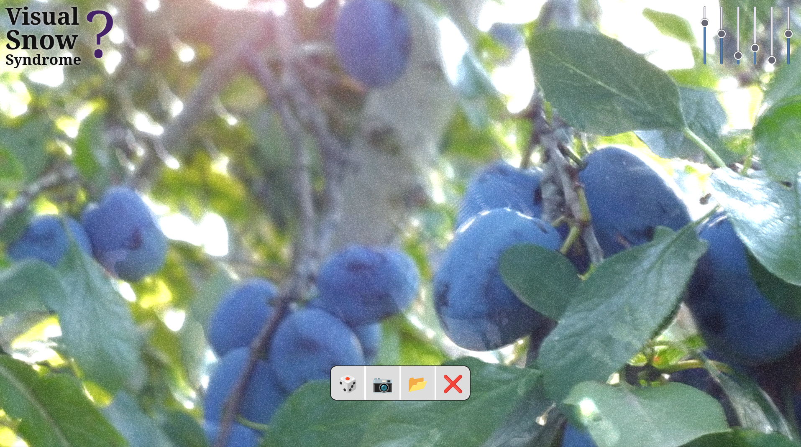
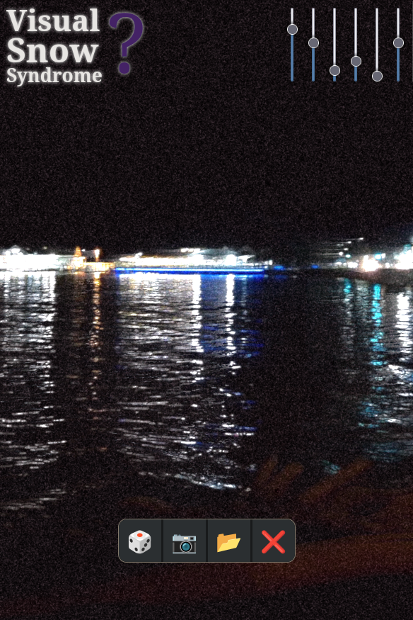
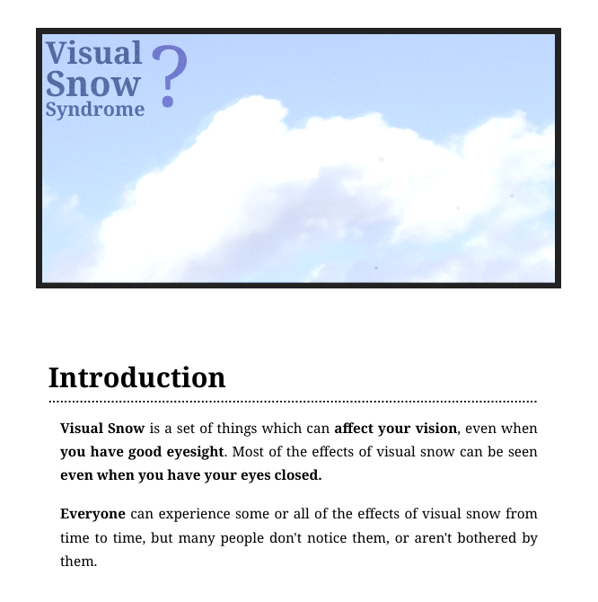

# visualsnow

A simulator and information about visual snow and visual snow syndrome (VSS).

Started development in the lead up to
[Neurodiversity Celebration Week 2026](https://www.neurodiversityweek.com/).

## Features

* Common visual snow effects implemented as GLSL fragment shaders
* Supports source of static images, videos and live webcam feed
* Responsive layout, adapts to light mode / dark mode / print media

## Screenshots

## Building / running

This is a completely static site, written in plain semantic HTML5, plain
Javascript and plain CSS. You don't have to build anything.

To use the webcam, you do however need to be viewing it on a web server that
serves HTTPS.

HTML, JS and CSS are being reformatted using `prettier` manually before
commits.

## Contributing

Do you Have The Thing? Would you like to add to the content of the site?
Any new research? Personal anecdotes? Are you also a Nerd who is getting
into Shaders? Hell yeah! Whoever you are, the pull requests will be
warmly accepted!

## License

Let's say the code is MIT and the assets are Creative Commons. The
information _on_ the site is of course public domain, open research and
community knowledge.